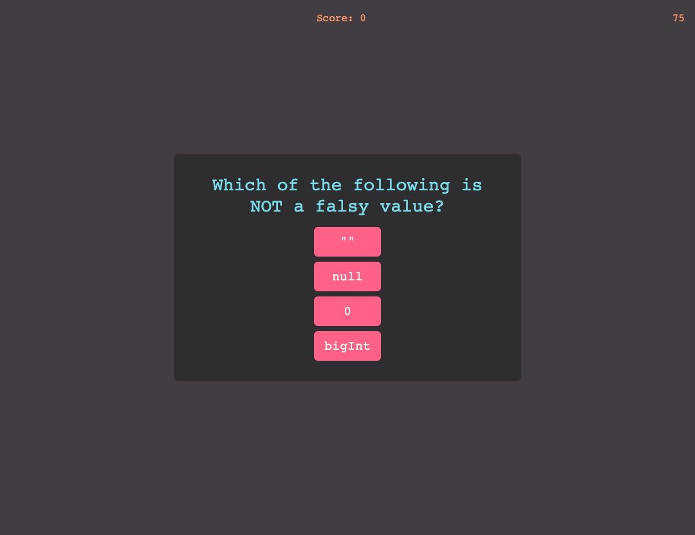

# Code Quiz Challenge
This challenge was to create an interactive quiz using HTML, CSS, and JavaScript that would increase the user's score when they selected the correct answer, or decrease the timer when they selected an incorrect answer. At the end of the quiz, users are able to submit their score to the highscore list.

## Deployment can be found here: 
https://bleakney.github.io/code-quiz/

## Screenshot of deployment:
